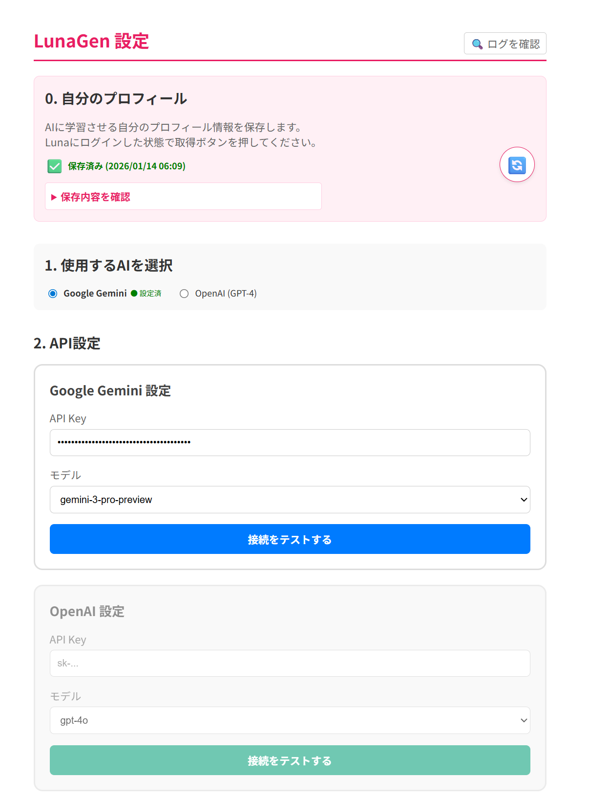

# LunaGen 🌙

マッチングサイト「Luna」のメッセージ作成をAI（Gemini / OpenAI）で強力に支援するChrome拡張機能です。相手のプロフィールをAPIレベルで解析し、自分との相性を踏まえた最適な初回メッセージを自動生成します。

---

## 📸 スクリーンショット / イメージ

### 1. メッセージ生成機能
サイト内のメッセージ入力欄に「AIで生成」ボタンが追加されます。クリックするだけで、相手のプロフィールに基づいた最適な文章が作成されます。


### 2. 設定画面
AIの選択、APIキーの設定、自分のプロフィールの学習など、すべてのカスタマイズをここで行います。


---

## 🌟 主な機能

- **AIメッセージ自動生成**: 相手のプロフィール（自己紹介、嗜好、SM属性など）を解析し、最適なメッセージを作成。
- **インテリジェント・インターセプト**: DOM解析に頼らず、サイト内部のAPI通信を傍受して正確な会員データを取得。
- **自分のプロフィール学習**: 自分のプロフィールを一度保存すれば、AIがそれを踏まえた「自分らしい」文章を生成。
- **ハイブリッドAI対応**: Google Gemini と OpenAI (GPT-4o等) から好みのAIを選択可能。
- **プレミアム自動検知**: 入力欄の文字数上限（プレミアムメッセージ=500）を見て自動判定し、AIに指示する文字数制限を490〜500文字へ拡張。

> **プロンプトを自分で編集している場合**: 拡張の更新時、プロンプトテンプレートを
> 一度も編集していなければ自動で最新版に更新されます。自分で編集した場合は
> 内容を保護するため自動更新されません。最新のデフォルトを取り込みたいときは、
> 設定画面の「2. プロンプトテンプレート」にある **「デフォルトに戻す」** を押してください。

---

## � セットアップ・使い方

### 1. インストール
1. リリースから最新の `chrome-mv3-prod.zip` をダウンロードし、決まったフォルダ（例: `LunaGen`）に解凍します。
2. Chrome の `chrome://extensions` を開き、「デベロッパーモード」を ON にします。
3. 「パッケージ化されていない拡張機能を読み込む」を選択し、解凍したフォルダを選択します。

**更新するとき**: 新しい ZIP を**同じフォルダに上書き解凍**し、`chrome://extensions` で LunaGen の 🔄（再読み込み）を押すだけです。
拡張を削除しない限り、APIキーなどの設定は引き継がれます（拡張IDは `manifest.key` で固定されています）。

> 以前 CRX でインストールしていた場合は、一度 CRX 版を削除してから上記手順で読み込んでください（同じIDのため併存できません）。
> 削除時に設定が消えるので、APIキーはこの切り替え時に一度だけ再入力が必要です。

### 2. 初期設定（APIキー等）
拡張機能のアイコンから「オプション」を開き、以下の設定を行います。

#### **A. 自分のプロフィールを覚えさせる**
1. ブラウザで **Lunaにログイン** します。
2. 設定画面の「0. 自分のプロフィール」セクションにある **🔄ボタン** をクリックします。
3. 「保存済み」と表示されれば成功です。これでAIがあなたのキャラクターを把握します。

#### **B. AI連携の設定（APIキーの取得）**
利用したいAIに合わせて以下のキーを用意してください。

| AIプロバイダー | 必要なもの | 取得場所 |
| :--- | :--- | :--- |
| **Google Gemini** | API Key (AIza...) | [Google AI Studio](https://aistudio.google.com/app/apikey) |
| **OpenAI** | API Key (sk-...) | [OpenAI API Dashboard](https://platform.openai.com/api-keys) |

1. 「1. 使用するAIを選択」で利用する方を選びます。
2. 「2. API設定」の該当する欄にキーを入力します。
3. **「接続をテストする」** を押し、緑色のチェックが表示されることを確認してください。

#### **C. 保存**
最後に一番下の **「設定を保存」** ボタンを必ず押してください。

---

## 🚀 開発者向け

このプロジェクトは [Plasmo](https://www.plasmo.com/) フレームワークを使用しています。

### 依存関係のインストール
```bash
pnpm install
```

### 開発用サーバーの起動
```bash
pnpm dev
```

### ビルド
```bash
pnpm build
```

---

## 📄 ライセンス
Copyright (c) 2026 PenguinWokrs <dev.and.penguin@gmail.com>